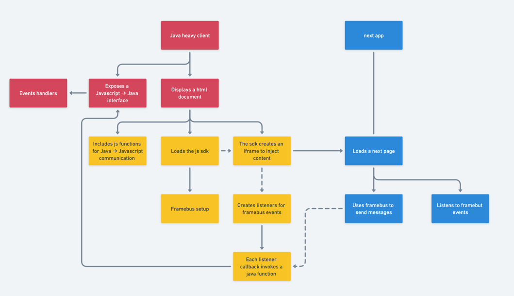

# sdk-test-java-app

This is a POC showcasing communication between a Java heavy client and a next web app. The web app can be found [Here](https://github.com/jpb06/sdk-test).

## Workflow

.

We need two way communication:
- Java heavy client -> Next app.
- Next app -> Java heavy client.

In order to do so, the strategy is to create a javascript sdk that will generate an iframe, and to rely on [post messages](https://developer.mozilla.org/en-US/docs/Web/API/Window/postMessage) to communicate between the java webview and our web app.

## Key code snippets

### Java -> Javascript communication

This part is easy enough. All we need to do is have a js script defined and execute a script via the `webEngine`:

```javascript
function getUser (id) {
    console.log(`trigger getUser ${id}`);
    window.sdk.emit('user.get', { id });
}
```

```java
webEngine.executeScript("getUser('128')");
```

### Javascript -> Java communication

We first need to create a bridge between our js and java. To do so, we will inject a class on `global.window`:

```java
public class JavascriptBridge {
    public void userAction(Object data) {
        System.out.println("Javascript -> Java - userAction(data) invoked");
        Gson gson = new GsonBuilder().serializeSpecialFloatingPointValues().serializeNulls().create();
        System.out.println("Java - userAction event payload: " + gson.toJson(data));
    }
}

webEngine.getLoadWorker().stateProperty().addListener(new ChangeListener<Worker.State>()
{ 
  @Override
  public void changed(ObservableValue ov, Worker.State oldState, Worker.State newState)
  {
    if (newState == Worker.State.SUCCEEDED)
    {
      JSObject jsGlobalWindow = (JSObject) webEngine.executeScript("window");
      jsGlobalWindow.setMember("javaApp", new JavascriptBridge());
    }
  }
});
```

In our js, we will setup a listener that will call `javaApp.userAction`:

```javascript
window.sdk.on("user.action", (data) => {
  console.info("Javascript - User.action listener");
  
  if(data.payload) {
    window.javaApp.userAction(data.payload);
  }
})
```

